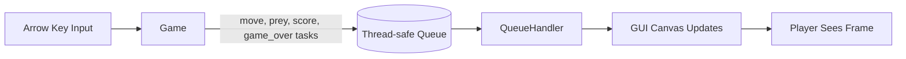
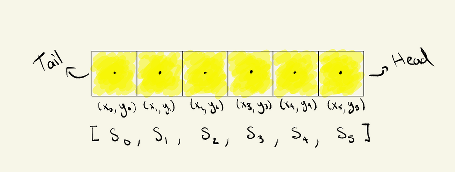
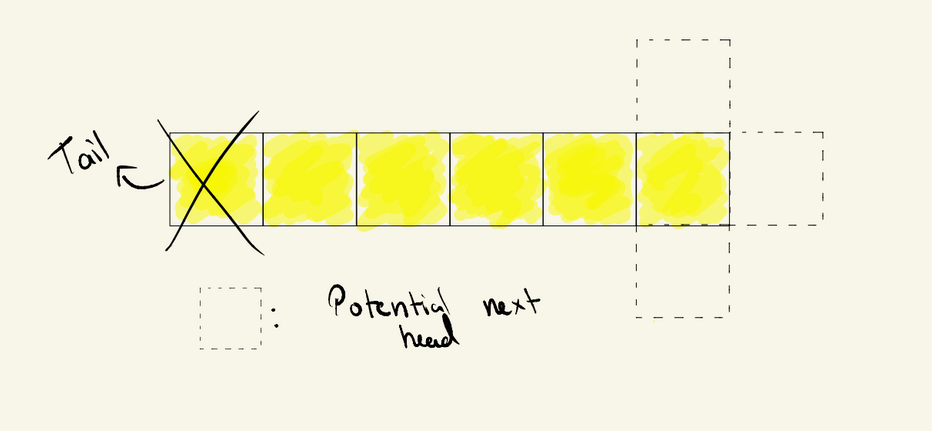
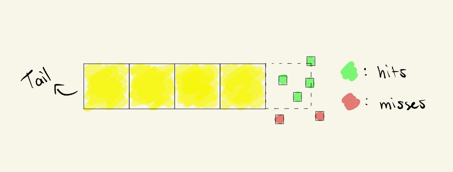
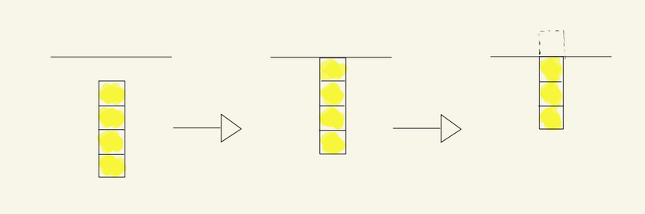

# Part 1

Group Number: B50  
Student Names: Felipe Nunes, Nima Karimzadehshirazi

## 1. Introduction

This document summarizes the open-ended design and implementation decisions for our Snake game in Part 1. The objective is to explain the game dynamics, the geometry used for prey capture, movement and collision logic, prey placement constraints, and the architecture used.

Our implementation uses three components:
- Game: owns game state and all game rules (skeleton provided)
- Gui: draws game elements and handles keyboard input (implementation provided)
- QueueHandler: transfers game updates to the GUI safely through a thread-safe queue (implementation provided)

## 2. Design and Implementation

### 2.1 High-Level Architecture

The system follows a producer-consumer model:
- Producer: Game superloop determines states and pushes tasks.
- Consumer: QueueHandler pulls from the tasks and applies them to the canvas.

Task types in the queue:
- move: snake coordinates
- prey: prey coordinates
- score: updated score value
- game_over: termination trigger

### 2.2 Visual Aid A - Component/Data Flow Diagram

Explanation:
- Input changes direction in Game.
- Game computes new state every tick and emits tasks.
- QueueHandler performs all drawing updates through the GUI thread.

### 2.3 Snake Movement Logic

The snake is represented by an ordered list of coordinates:

S = [s0, s1, ..., sn],  where sn is the head.

At each move:
1. Compute a new head based on current direction.
2. Append new head to S.
3. If prey is not captured, remove the tail s1.
4. If prey is captured, keep tail (snake grows by one segment).

Movement equation:

x_new = x_head + delta_x * w_s  
y_new = y_head + delta_y * w_s

Where:
- w_s is snake segment width (SNAKE_ICON_WIDTH)
- (delta_x, delta_y) is one of:
  - Left: (-1, 0)
  - Right: (1, 0)
  - Up: (0, -1)
  - Down: (0, 1)

### 2.4 Prey Capture Geometry

The prey is a rectangle:

R_prey = [x1, y1, x2, y2]

The snake head is represented by a center point, but the rendered snake segment has nonzero width. To avoid visually unfair misses, capture is decided by expanding prey bounds by half of the snake width:

x1 - w_s/2 <= x_head <= x2 + w_s/2  
y1 - w_s/2 <= y_head <= y2 + w_s/2

If both inequalities hold, prey is captured.

This produces a practical hit-test that better matches what the player sees on screen.

### 2.6 Prey Placement Strategy

A new prey center is chosen uniformly at random with a border threshold:

x ~ Uniform(THRESHOLD + w_p/2, WINDOW_WIDTH - THRESHOLD - w_p/2)  
y ~ Uniform(THRESHOLD + w_p/2, WINDOW_HEIGHT - THRESHOLD - w_p/2)

Then prey rectangle is:

[x - w_p/2, y - w_p/2, x + w_p/2, y + w_p/2]

Where w_p is prey width.

Design rationale:
- Keeps prey away from walls for easier access and better playability.
- Ensures prey is fully visible (not clipped outside canvas).

### 2.7 Collision and Game Over Logic

Game over occurs if the new head:
- Leaves the valid canvas area, or
- Intersects snake body (self-collision)

Boundary condition:

x_head < 0 or x_head >= WINDOW_WIDTH or y_head < 0 or y_head >= WINDOW_HEIGHT

Self-collision condition:
S
count(head_position in snakeCoordinates) > 1

The count-based check is used because the new head is appended before collision evaluation.

## 3. Challenges and Future Improvements

### 3.1 Challenges Faced

1. Synchronization between logic timing and GUI refresh.
- Game logic runs in a background thread, while GUI updates must be in the Tk event loop.
- Queue-based communication was used to avoid unsafe direct GUI updates from worker threads.

2. Fair prey capture behavior.
- Point-in-rectangle checks felt too strict because snake has visible width.
- Expanding prey bounds by half snake width improved perceived fairness.

3. Collision edge behavior near boundaries.
- Careful inequality choice (>= vs >) is required to prevent inconsistent border deaths.

4. Event timing and input granularity.
- Multiple key presses between ticks may collapse to the last direction before next update.

### 3.2 Known Issues Tracked During Development

1. Game-loop updates can outpace GUI redraws.
- This can cause visible jumps in snake movement.

2. Multiple key presses within one superloop interval collapse to the last valid direction input.
- This is expected from fixed-interval input sampling and is currently documented as a behavior limitation.

3. Remaining issue: self-collision may end the game before the final movement is rendered.
- This appears as an early Game Over transition relative to the visible final frame.

4. Remaining issue: bottom/right wall collision appears to trigger slightly early.
- This is tracked as a boundary-condition behavior requiring further tuning.

## 4. Conclusion
This project demonstrates a clean separation of concerns between game logic, event handling, and rendering through a queue-based architecture. The main algorithm is a fixed-rate simulation loop that updates snake geometry, evaluates prey capture via expanded-rectangle geometry, and detects terminal collisions. The current implementation is functional and understandable, while still leaving clear room for incremental improvements in robustness, fairness, and performance.

