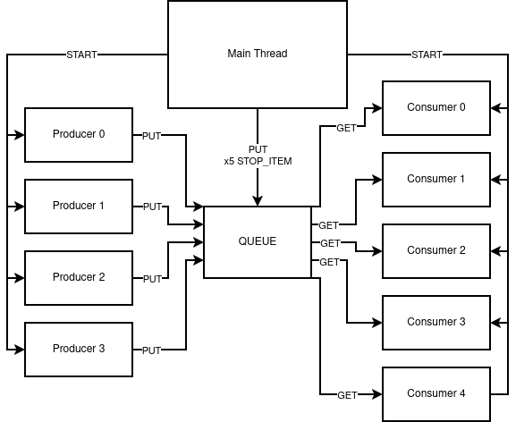
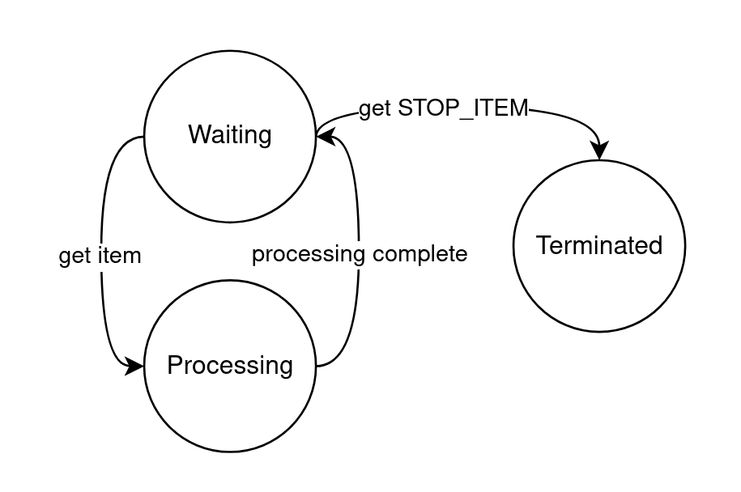

# Part 2

Group Number: B50  
Student Names: Felipe Nunes, Nima Karimzadehshirazi

## 1. Introduction

This document explains the design and implementation decisions for Part 2, which focuses on a multithreaded producer-consumer system using Python threads and a thread-safe queue. The goal is to coordinate multiple producers and consumers safely, while ensuring all threads terminate gracefully.

The implementation uses:
- 4 producer threads
- 5 consumer threads
- 1 shared queue buffer
- sentinel-based shutdown for consumers after producers finish

## 2. Design Overview

The queue acts as the synchronization utility and protects shared state access (no custom locks are required for queue operations).

### 2.2 Architectural Roles

- Main thread:
  - Creates shared queue and constants.
  - Starts producer/consumer threads.
  - Waits for producers to finish.
  - Sends one stop sentinel per consumer.
  - Joins all consumers.
- Producer thread:
  - Repeats: delay -> generate item -> queue.put(item)
  - Stops after producing a fixed number of items.
- Consumer thread:
  - Repeats: queue.get() -> if sentinel then exit else process item

## 3. Implementation Decisions

### 3.1 Queue-Based Concurrency

A Python thread-safe queue is used as the shared buffer. This provides:
- safe concurrent `put`/`get`
- blocking behavior that naturally coordinates producers and consumers
- simpler code than manual lock management

### 3.2 Production and Consumption Timing

Both producers and consumers simulate work by sleeping a random time in $[0.1, 0.3]$ seconds.

For each producer iteration:
- sleep random interval
- generate item in $[1,99]$
- enqueue item

For each consumer iteration:
- dequeue item (blocking)
- if item is sentinel: terminate
- otherwise sleep random interval to simulate consumption

### 3.3 Fixed Workload per Producer

Each producer creates exactly 10 items (`NUMBER_OF_ITEMS_TO_PRODUCE = 10`). With 4 producers:

$$
\text{Total Produced} = 4 \times 10 = 40
$$

Consumers collectively process all produced items, then each receives one sentinel.

### 3.4 Consumer Shutdown (Sentinel Strategy)

A single sentinel value (`STOP_ITEM = None`) is used to signal termination.

Shutdown protocol:
1. Main waits for all producers to `join()`.
2. Main enqueues exactly one sentinel per consumer.
3. Each consumer exits immediately after receiving one sentinel.
4. Main `join()`s all consumers.

## 4. Visual Aids

### 4.1 Figure 1 - System Architecture (Static View)

  

### 4.2 Figure 2 - Consumer State Machine

  
  

  

## 5. Code Considerations

### 5.1 Safety

- Queue operations are thread-safe.

### 5.2 Liveness

- Producers have finite loops (always terminate).

### 5.3 Ordering 

- Queue is FIFO globally.

## 6. Challenges and Improvements

### 6.1 Challenges Faced

1. Thread termination design.
- Without a termination protocol, consumers may block indefinitely (Sentinel-based signaling solved this issue for us)

2. Balancing clarity and correctness.
- We avoided overengineering by using queue semantics directly.

### 6.2 Future Improvements (Not Included in Submitted Code)

1. Instrumentation and metrics.
- Track throughput, queue occupancy over time, and producer/consumer utilization.

2. Structured logging.
- Add timestamps and thread IDs with deterministic formatting for easier analysis.

## 7. Conclusion

Part 2 demonstrates a correct and readable implementation of a multithreaded producer-consumer system. The design combines thread-safe queue communication, randomized asynchronous behavior, and explicit sentinel-based shutdown. The final implementation meets the assignment objectives while preserving opportunities for future incremental improvements.

