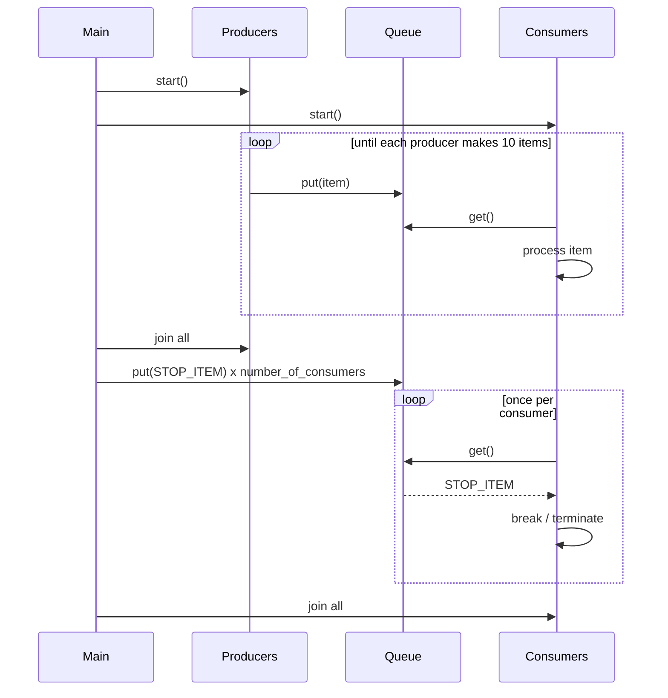
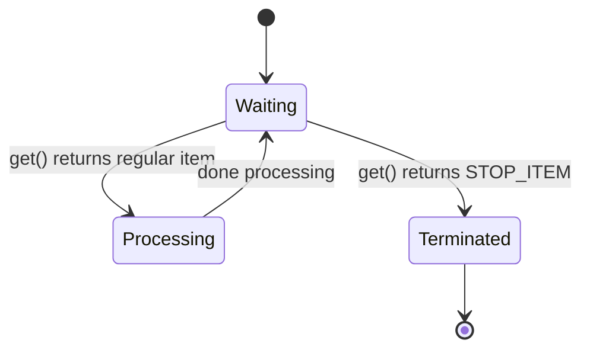

# CPEN 333 Snake Game - Part 2 Additional Documentation

Group Number: B50  
Student Names: Felipe Nunes, Nima Karimzadehshirazi

## 1. Introduction

This document explains the design and implementation decisions for Part 2, which focuses on a multithreaded producer-consumer system using Python threads and a thread-safe queue. The goal is to coordinate multiple producers and consumers safely, while ensuring all threads terminate gracefully.

The implementation uses:
- 4 producer threads
- 5 consumer threads
- 1 shared queue buffer
- sentinel-based shutdown for consumers after producers finish

## 2. Design Overview

### 2.1 Problem Model

Part 2 is modeled as a bounded-time concurrent workflow:
- Producers generate integer items and place them in a shared queue.
- Consumers remove items from the queue and process them.
- The main thread coordinates startup, synchronization, and graceful shutdown.

The queue acts as the synchronization boundary and protects shared state access (no custom locks are required for queue operations).

### 2.2 Architectural Roles

- Main thread:
  - Creates shared queue and constants.
  - Starts producer/consumer threads.
  - Waits for producers to finish.
  - Sends one stop sentinel per consumer.
  - Joins all consumers.
- Producer thread:
  - Repeats: delay -> generate item -> queue.put(item)
  - Stops after producing a fixed number of items.
- Consumer thread:
  - Repeats: queue.get() -> if sentinel then exit else process item

## 3. Implementation Decisions

### 3.1 Queue-Based Concurrency

A Python thread-safe queue is used as the shared buffer. This provides:
- safe concurrent `put`/`get`
- blocking behavior that naturally coordinates producers and consumers
- simpler code than manual lock management

Why this design:
- correctness is delegated to a well-tested library primitive
- code remains readable and compact
- behavior matches producer-consumer textbook architecture

### 3.2 Production and Consumption Timing

Both producers and consumers simulate work by sleeping a random time in $[0.1, 0.3]$ seconds.

For each producer iteration:
- sleep random interval
- generate item in $[1,99]$
- enqueue item

For each consumer iteration:
- dequeue item (blocking)
- if item is sentinel: terminate
- otherwise sleep random interval to simulate consumption

Design rationale:
- random delays create realistic asynchronous interleavings
- demonstrates queue correctness under nondeterministic scheduling

### 3.3 Fixed Workload per Producer

Each producer creates exactly 10 items (`NUMBER_OF_ITEMS_TO_PRODUCE = 10`). With 4 producers:

$$
\text{Total Produced} = 4 \times 10 = 40
$$

Consumers collectively process all produced items, then each receives one sentinel.

### 3.4 Graceful Consumer Shutdown (Sentinel Strategy)

A single sentinel value (`STOP_ITEM = None`) is used to signal termination.

Shutdown protocol:
1. Main waits for all producers to `join()`.
2. Main enqueues exactly one sentinel per consumer.
3. Each consumer exits immediately after receiving one sentinel.
4. Main `join()`s all consumers.

Why one sentinel per consumer:
- ensures every consumer has a guaranteed termination signal
- prevents consumers from blocking forever on `get()` after production ends

## 4. Visual Aids

### 4.1 Component Diagram

```mermaid
flowchart LR
    M[Main Thread] -->|start| P1[Producer x4]
    M -->|start| C1[Consumer x5]
    P1 -->|put(item)| Q[(Shared Queue)]
    Q -->|get(item)| C1
    M -->|after producers join: put STOP_ITEM x5| Q
```

### 4.2 Runtime Sequence (Simplified)



### 4.3 State Diagram (Consumer)



## 5. Correctness and Concurrency Considerations

### 5.1 Safety

- Queue operations are thread-safe.
- No shared mutable data is accessed directly by multiple threads outside queue operations.
- Consumers terminate only on explicit sentinel receipt.

### 5.2 Liveness

- Producers have finite loops (always terminate).
- Consumers block on `get()`, but are guaranteed eventual termination due to one sentinel per consumer.
- Main thread waits for all child threads, ensuring clean completion.

### 5.3 Ordering Behavior

- Queue is FIFO globally.
- Interleaving among different producers is nondeterministic (depends on scheduling and random delays).
- Therefore exact per-thread production/consumption ordering is not deterministic, but the protocol remains correct.

## 6. Challenges and Improvements

### 6.1 Challenges Faced

1. Thread termination design.
- Without a termination protocol, consumers may block indefinitely.
- Sentinel-based signaling solved this cleanly.

2. Nondeterministic debug traces.
- Print ordering varies run to run due to scheduling.
- This is expected in concurrent execution and not a correctness bug.

3. Balancing clarity and correctness.
- We avoided overengineering (manual locks/conditions) by using queue semantics directly.

### 6.2 Future Improvements (Not Included in Submitted Code)

1. Bounded queue capacity.
- Use `queue.Queue(maxsize=N)` to model finite buffer pressure and producer backpressure.

2. Instrumentation and metrics.
- Track throughput, queue occupancy over time, and producer/consumer utilization.

3. Structured logging.
- Add timestamps and thread IDs with deterministic formatting for easier analysis.

4. Use `task_done()` / `join()` semantics on queue.
- Could provide explicit completion tracking for produced work items.

5. Robust stop-token design.
- Replace `None` with a unique sentinel object to avoid ambiguity if `None` could ever be valid payload.

## 7. Conclusion

Part 2 demonstrates a correct and readable implementation of a multithreaded producer-consumer system. The design combines thread-safe queue communication, randomized asynchronous behavior, and explicit sentinel-based shutdown to ensure both safety and graceful termination. The final implementation meets the assignment objectives while preserving opportunities for future incremental improvements.

---

Suggested export workflow:
1. Open this Markdown file in preview.
2. Export/print to PDF.
3. Submit as one Part 2 PDF file.
